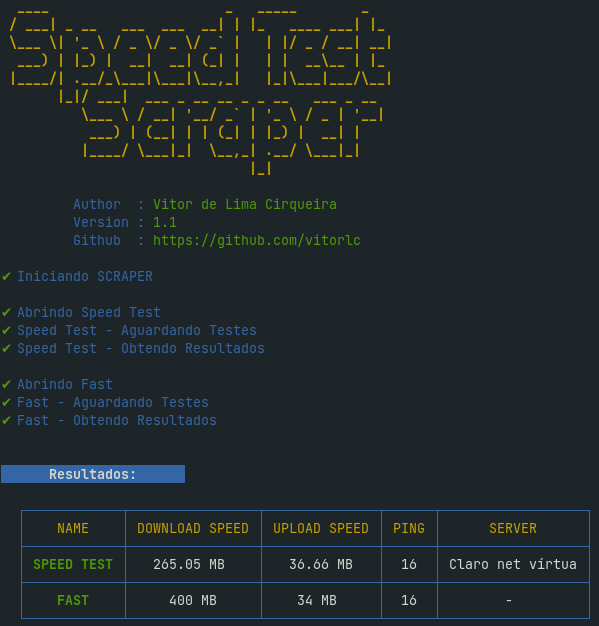

<h1 align="center">Speed Test Scraper</h1>
<p align="center">Measure your internet speed in your CLI with the main services in the market (Speedtest, Fast, MinhaConexão) </p>


## 🚀 Demo



## ✨ Usage

```
npx github:vitorlc/speed-test-scraper
```

## 📣 Contributing

If you want to contribute please fork the repository and get your hands dirty, and make the changes as you'd like and submit the Pull Request.